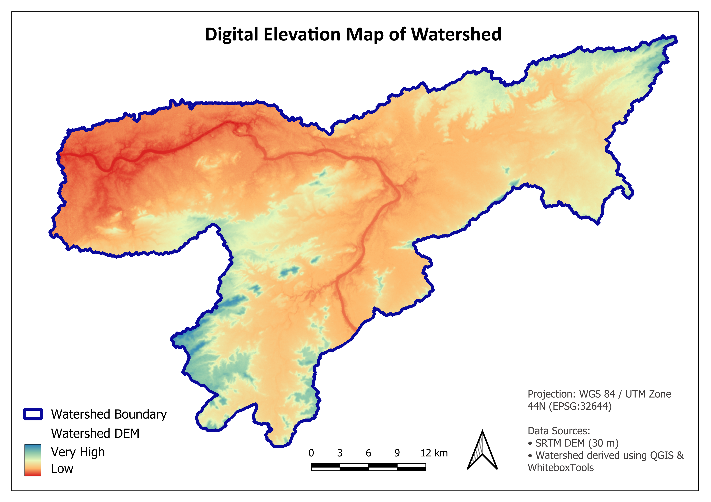
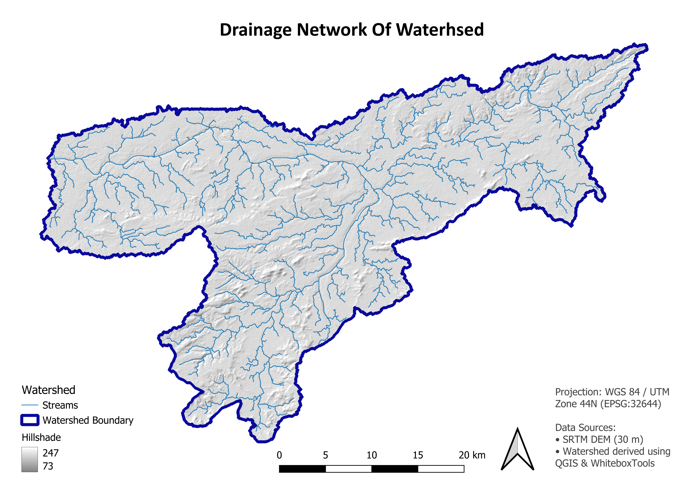
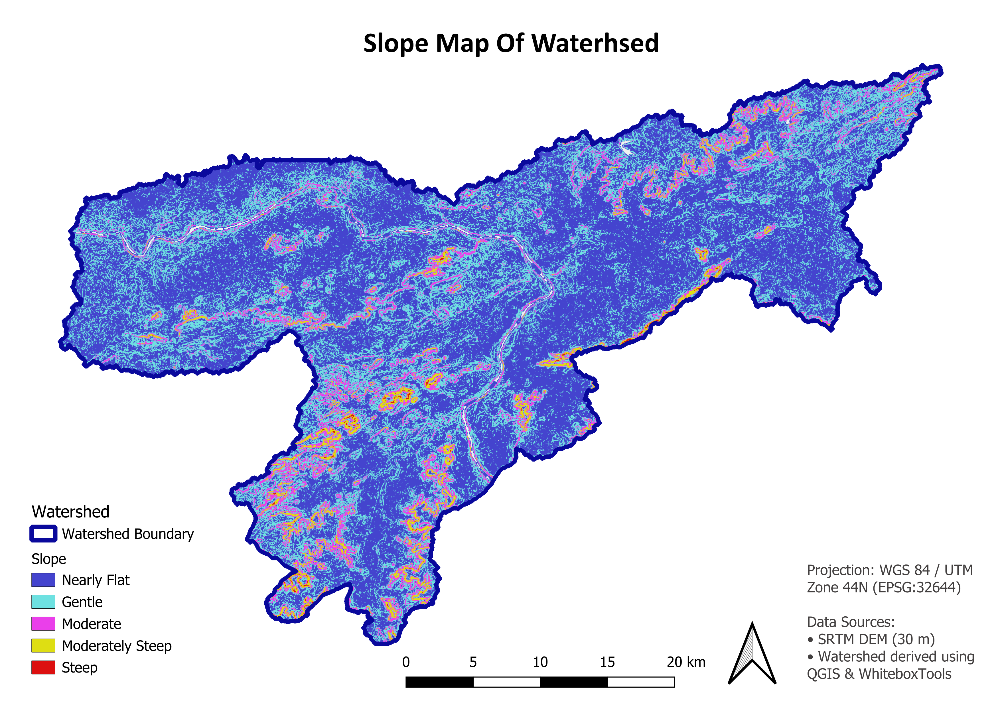
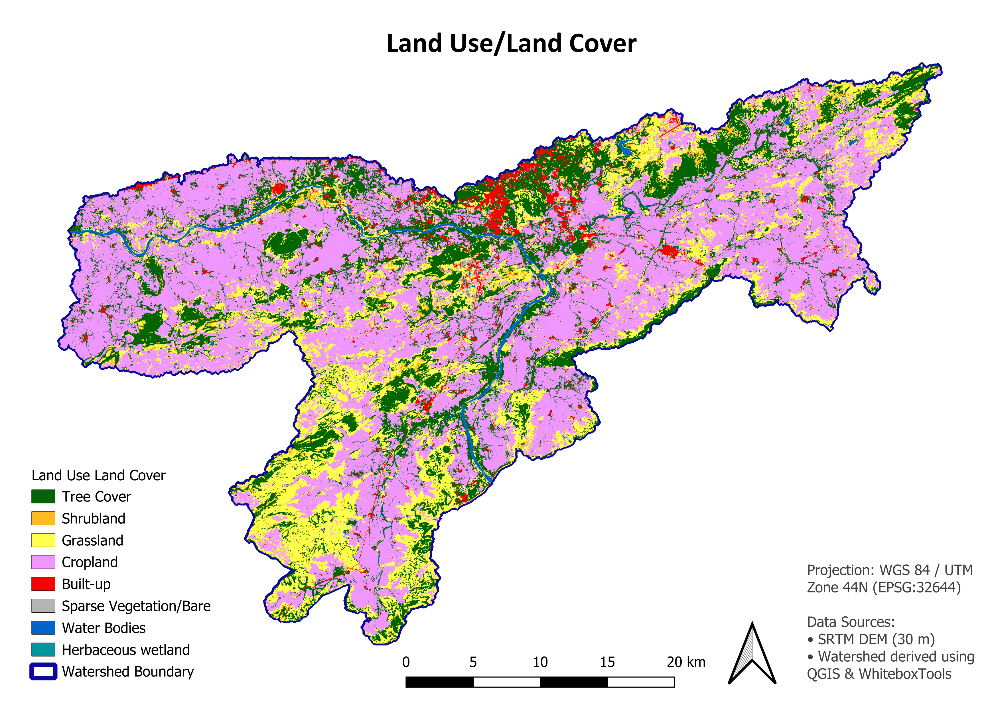

# Narmada Watershed Delineation and Morphometric Analysis using QGIS
### Watershed Boundary


### Digital Elevation Model (DEM)



### Contour Map


### Drainage Network



### Slope Map



### NDVI


### Land Use / Land Cover


## Project Overview

This project demonstrates the complete workflow for watershed delineation, terrain analysis, hydrological modeling, vegetation assessment, and land use/land cover (LULC) analysis using open-source GIS tools.

The watershed was delineated from a Digital Elevation Model (DEM) using hydrological analysis techniques in QGIS and WhiteboxTools. Terrain characteristics, drainage network, morphometric parameters, NDVI, and ESA WorldCover-based land cover were analyzed to understand the watershed's physical characteristics.

---

## Objectives

- Delineate the Narmada watershed from a DEM.
- Generate hydrological layers including flow direction, flow accumulation, and stream network.
- Produce terrain maps such as DEM, slope, hillshade, and contours.
- Assess vegetation using Landsat 8 NDVI.
- Analyze land use and land cover using ESA WorldCover.
- Calculate key morphometric parameters of the watershed.

---

## Study Area

- Watershed: Narmada Watershed
- Projection: WGS 84 / UTM Zone 44N (EPSG:32644)

---

## Software Used

- QGIS 3.44
- GDAL
- ESA WorldCover Dataset
- Landsat 8 Surface Reflectance
- SRTM DEM (30 m)

---

## Workflow

```text
SRTM DEM
    │
    ▼
Fill Sinks
    │
    ▼
Flow Direction
    │
    ▼
Flow Accumulation
    │
    ▼
Stream Extraction
    │
    ▼
Watershed Delineation
    │
    ├────────► DEM
    ├────────► Hillshade
    ├────────► Slope
    └────────► Contours

Landsat 8
    │
    ▼
NDVI

ESA WorldCover
    │
    ▼
Clip to Watershed
    │
    ▼
LULC Analysis
```

---

## Results

The following thematic maps were generated:

- Watershed Boundary
- Digital Elevation Model (DEM)
- Slope Map
- Stream Network
- Contour Map
- NDVI Map
- Land Use/Land Cover (ESA WorldCover)

---

## Morphometric Parameters

| Parameter | Value |
|------------|-------|
| Watershed Area | 1187.59 km² |
| Watershed Perimeter | 367.14 km |
| Basin Relief | 310.40 m |
| Total Stream Length | 1062.43 km |
| Number of Stream Segments | 1639 |
| Drainage Density | 0.895 km/km² |
| Stream Frequency | 1.38 streams/km² |

---

## Repository Structure

```
Data/
Outputs/
Maps/
Report/
README.md
Watershed_Project.qgz
```

---

## Skills Demonstrated

- Watershed Delineation
- Hydrological Analysis
- DEM Processing
- Terrain Analysis
- Remote Sensing
- NDVI Computation
- Land Use/Land Cover Analysis
- Morphometric Analysis
- Cartographic Map Design
- Spatial Data Processing using QGIS

---

## Future Improvements

- Random Forest-based LULC Classification
- Accuracy Assessment
- Stream Order Analysis
- Flood Susceptibility Mapping
- Watershed Prioritization

---

## Author

Priyanka
